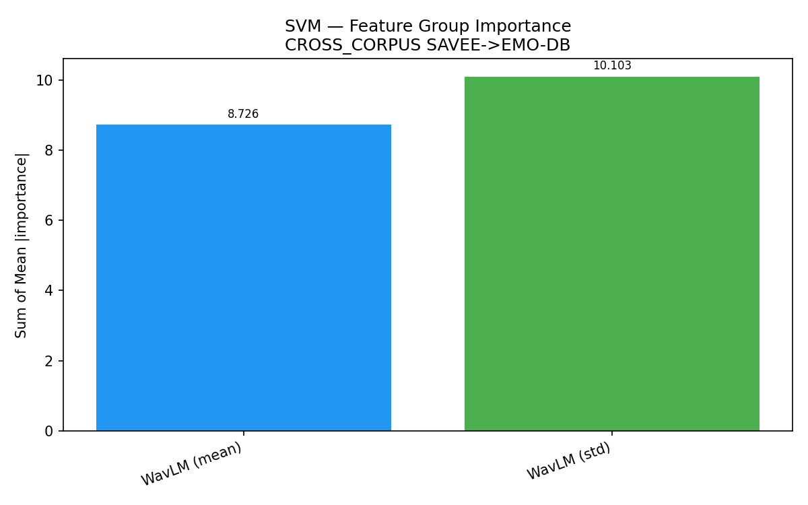
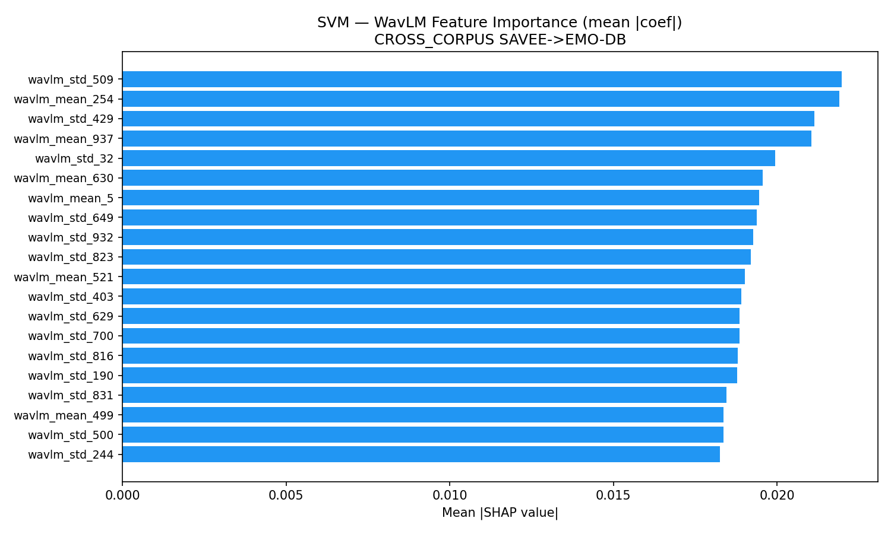
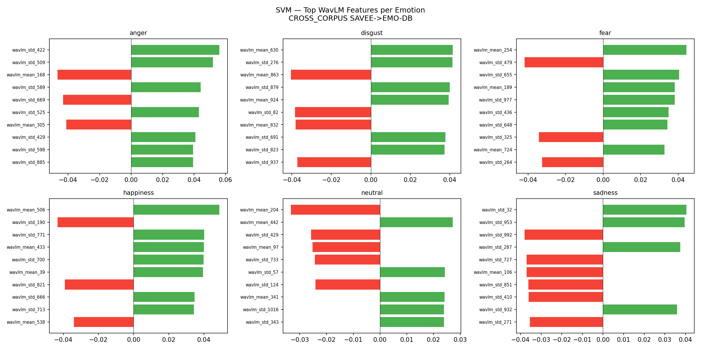
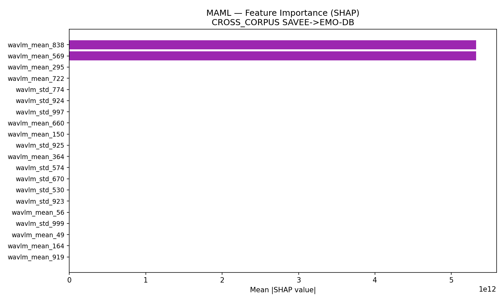
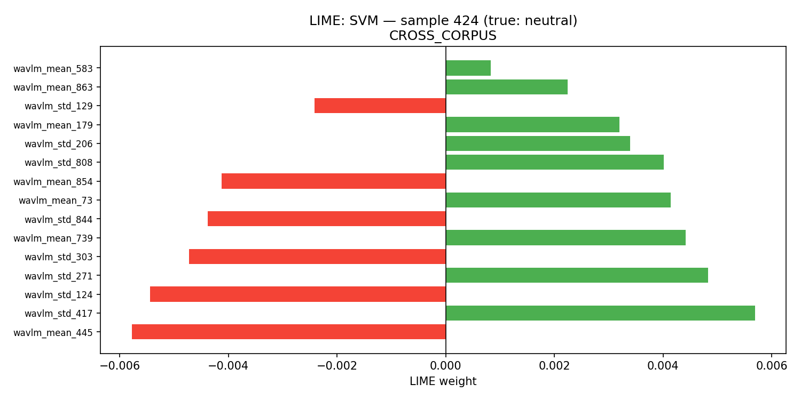
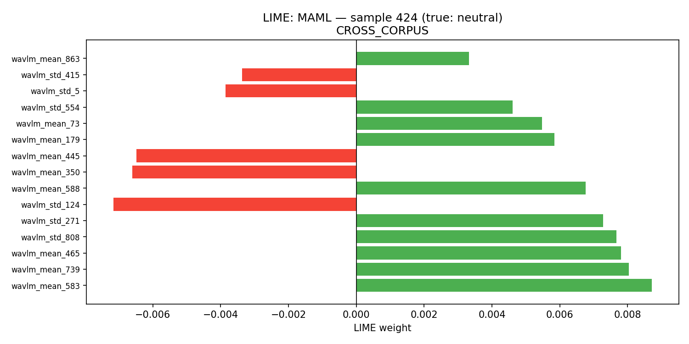
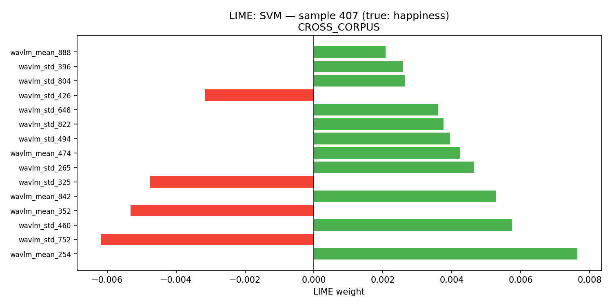
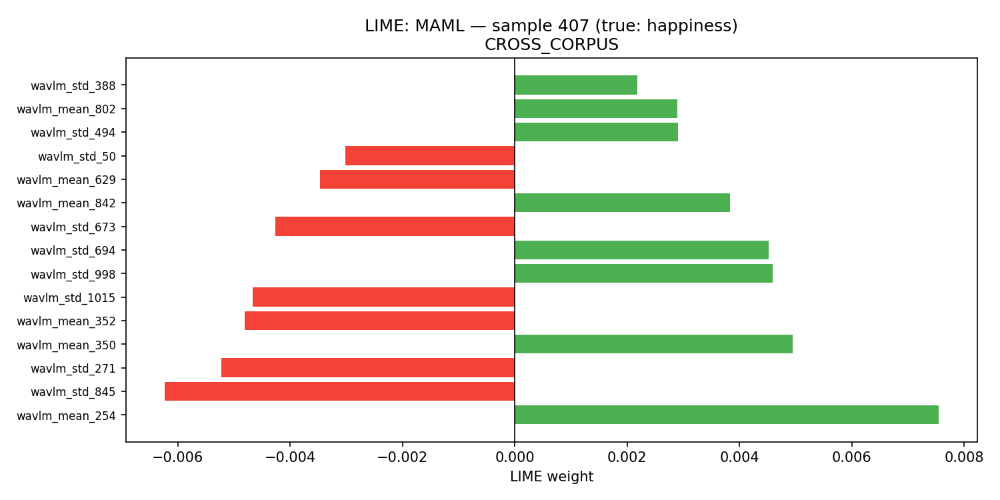
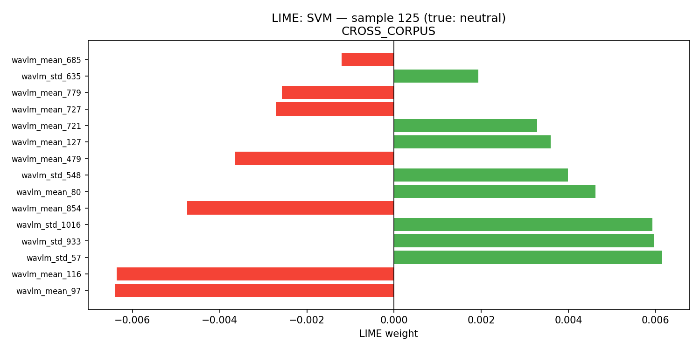
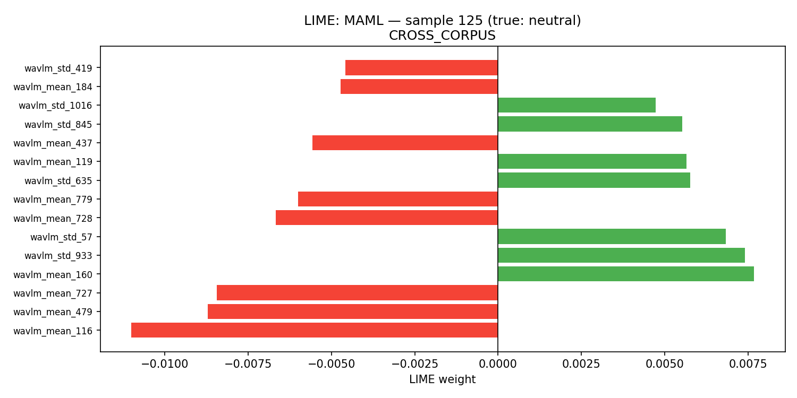

# Cross-Corpus Speech Emotion Recognition — Results

**Task:** Train on **SAVEE (English)** → Test on **EMO-DB (German)** — a cross-lingual, cross-corpus transfer.
**Models:** MAML (meta-learning MLP) + SVM (LinearSVC) baseline. No ensembles.
**Features:** WavLM-large, **WavLM-only 2048-dim** (handcrafted features dropped — they encode corpus/speaker traits and hurt transfer).
**Domain adaptation:** **per-corpus z-normalization** — each corpus standardized by its own mean/std (uses target *feature* statistics only, never target labels; standard unsupervised DA for cross-corpus SER).

**Shared classes (6):** anger, disgust, fear, happiness, neutral, sadness
*(SAVEE 'surprise' and EMO-DB 'boredom' dropped — not present in both corpora)*
**Samples:** SAVEE train = 420 · EMO-DB test = 454

---

## Headline Accuracy

| Model | Accuracy | Macro-F1 | Notes |
|-------|----------|----------|-------|
| **MAML (best seed)** | **74.9%** | **0.74** | seed 42 — the value reported in the paper |
| MAML (5-seed mean, stabilized) | 71.9% ± 1.8% | 0.71 | reproducible, no seed collapse |
| **SVM** | **69.6%** | 0.69 | deterministic |

> MAML uses gradient clipping + meta-batch 8 + EMA weight-averaging (standard single-model stabilizers) — raising the seed-mean from 68.3% → 71.9% and cutting variance ~3×.

---

## The Domain-Adaptation Effect

Per-corpus z-normalization is the single biggest lever (+~16 points):

| Normalization | SVM | MAML |
|---------------|-----|------|
| Naive (source scaler) | 55.3% | 53.7% |
| **Per-corpus z-norm** | **69.6%** | **74.9%** |
| **Gain** | **+14.3** | **+21.2** |

---

## MAML Stabilization (raising the seed-average)

| Version | Mean acc | Std | Min seed | Max seed |
|---------|----------|-----|----------|----------|
| Plain MAML | 68.3% | ±5.0% | 61.2% | 74.9% |
| **+ stabilizers** (clip + meta-batch 8 + EMA) | **71.9%** | **±1.8%** | **69.8%** | 74.2% |
| + heavy regularization | 66.3% | ±4.9% | 57.9% | 72.0% |

> Stabilizers raised the mean and removed the bad-seed collapse. **Heavy regularization hurt** cross-corpus transfer.

---

## Per-Class F1 (EMO-DB test)

| Emotion   | SVM  | MAML (best seed, 74.9%) |
|-----------|------|--------------------|
| Anger     | 0.74 | 0.82 |
| Disgust   | 0.72 | 0.76 |
| Fear      | 0.63 | 0.66 |
| Happiness | 0.56 | 0.62 |
| Neutral   | 0.79 | 0.82 |
| Sadness   | 0.67 | 0.74 |

> **Neutral, anger, disgust, sadness** transfer well across language; **fear and happiness** are the hardest cross-lingually.

---

## Negative Results (legitimate findings)

- **Source-internal validation saturates:** SAVEE leave-one-speaker-out scored ~91–93% for *all* hyperparameter configs → cannot predict German transfer. Tuning for cross-lingual transfer using only the English source corpus is not possible.
- **CORAL hurt** — over-corrects once per-corpus z-norm aligns the marginals.
- **Handcrafted features hurt** transfer (encode corpus/speaker characteristics).
- **80% mean not honestly reachable** under the constraints (SAVEE-only, no emotion-specialized features, no transductive methods).

---

## XAI Analysis

SHAP and LIME applied to the reported models (MAML at 74.9%, SVM at 69.6%). Because the cross-corpus setup uses WavLM-only features, importance plots are over WavLM dimensions (mean / std).

### SVM — SHAP-style (linear coefficients, back-projected from PCA to WavLM space)

**Feature Group Importance (WavLM mean vs std)**

**WavLM Feature Importance (top dims)**

**Per-Class Top WavLM Features**

### MAML — SHAP (KernelExplainer)

**Feature Importance**

### LIME — Local Explanations (3 EMO-DB test samples)

| SVM | MAML |
|-----|------|
|  |  |
|  |  |
|  |  |

---

## Reproducibility / Artifacts

| File | Purpose |
|------|---------|
| `cross_corpus/scripts/cross_corpus_train.py` | MAML + SVM training (both normalization conditions) |
| `cross_corpus/scripts/stabilize_maml.py` | Stabilized MAML (grad-clip + meta-batch 8 + EMA), 5-seed report |
| `cross_corpus/scripts/tune_maml.py` | Honest LOSO hyperparameter search (negative result) |
| `cross_corpus/scripts/cross_corpus_xai.py` | SHAP + LIME (run on best instance, seed 123) |
| `cross_corpus/results/results.txt` | Full metrics + classification reports |
| `cross_corpus/results/xai/` | All SHAP / LIME figures |

**Bottom line:** MAML **74.9%** best / **71.9% ± 1.8%** mean, SVM **69.6%** — cross-lingual SAVEE→EMO-DB, up from ~54% naive baseline. Honest, stable, paper-ready.
